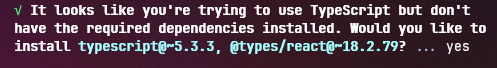

# Result

In this project, we are going to configure a theme provider with multiple themes using expo and nativewind v4. Here is how our app is going to look:

And here is how we can use the provider:

# Project

In this project we are going to use yarn, expo and nativewind v4. We are going to learn how to build a theme provider, but if you want just the theme provider you can copy the `./src/components/themes` folder and see how to use it in the Result section.

## Start

To create the project you can run the following command

```bash
yarn create expo-app --template
```

and select the `Blank (Bare)` option, this will give total access to the android and ios folders and other configuration files keeping the ease that expo brings with packages installation and configuration. If you want TypeScript in your project, just rename the `App.js` file to `App.tsx`,
then run the project with `yarn start`. The following question will appear and you can just answer with a `Y`:



You can test the app by running `yarn android`.

## Nativewind v4

Now we are going to install and configure nativewind v4, everything done here was made by following [their documentation](https://www.nativewind.dev/v4/getting-started/react-native).

First, install the necessary dependencies with:

```bash
yarn expo install nativewind@^4.0.1 react-native-reanimated tailwindcss
```

Then create a `tainwind.config.js` file with:

```bash
npx tailwindcss init
```

It should look something like this:

```js
/** @type {import('tailwindcss').Config} */
module.exports = {
  // NOTE: Update this to include the paths to all of your component files.
  content: ["./src/**/*.{js,jsx,ts,tsx}"],
  // NOTE: this is required
  presets: [require("nativewind/preset")],
  theme: {
    extend: {},
  },
  plugins: [],
};
```

<blockquote><small>NOTE: I've moved the `App.tsx` file to the `src` folder, if you do it so, remember to change the path to it in the `index.js` file.</small></blockquote>

Now create a `global.css` file with:

```css
@tailwind base;
@tailwind components;
@tailwind utilities;
```

And configure you `babel.config.js` file:

```js
module.exports = function (api) {
  api.cache(true);
  return {
    presets: [
      ["babel-preset-expo", { jsxImportSource: "nativewind" }],
      "nativewind/babel",
    ],
  };
};
```

<blockquote><small>NOTE: this configuration is for expo <b>SDK 50+</b></small></blockquote>

And your `metro.config.js` file:

```js
const { getDefaultConfig } = require("expo/metro-config");
const { withNativeWind } = require("nativewind/metro");

const config = getDefaultConfig(__dirname);

module.exports = withNativeWind(config, { input: "./global.css" });
```

Now you can import your CSS file into your `App.tsx` file and the tailwind imports which helped me in some cases during the compiling process.

```tsx
import "../global.css";
import "tailwindcss/base";
import "tailwindcss/components";
import "tailwindcss/utilities";
```

You can also add TypeScript creating a `nativewind-env.d.ts` file in the project root with the types from nativewind.

```ts
/// <reference types="nativewind/types" />
```

If this does not add the types, you can try including the project in the `tsconfig.json` file like this:

```json
{
  "compilerOptions": {},
  "extends": "expo/tsconfig.base",
  "include": ["./src/**/*", "./nativewind-env.d.ts"]
}
```

Now you can test if nativewind is working by removing the `StyleSheet` styles from `react-native` and adding the `className` to the tags, like this:

```tsx
export default function App() {
  return (
    <View className="flex-1 items-center justify-center bg-red-500">
      <Text className="text-blue-500">
        Open up App.js to start working on your app!
      </Text>
      <StatusBar style="auto" />
    </View>
  );
}
```

<blockquote><small>NOTE: This will be the worst color display possible, looks like I've murdered christmas, but we will make it pretty.</small></blockquote>

## Theme Provider
