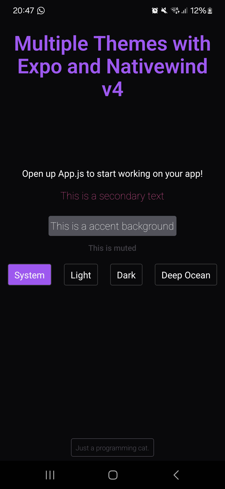
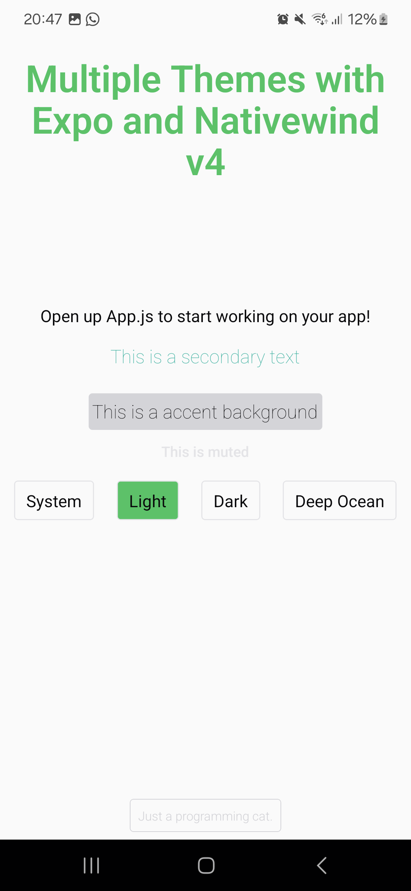
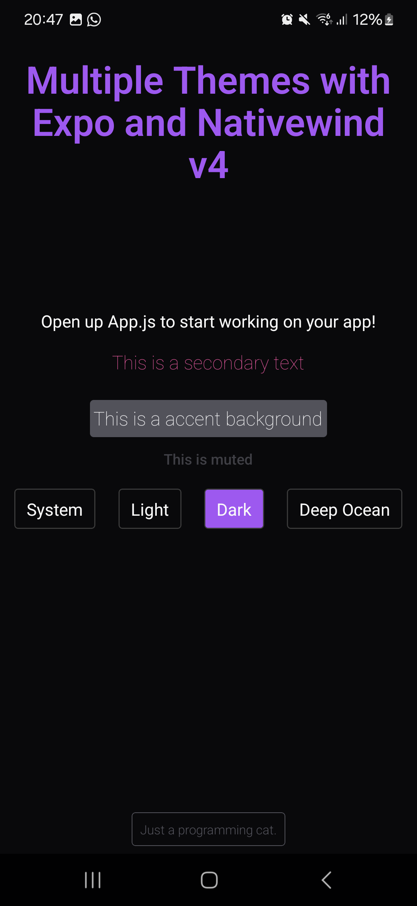
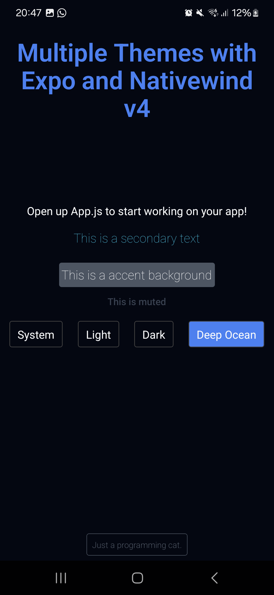

# Result

In this project, we are going to configure a theme provider with multiple themes using expo and nativewind v4. Here is how our app is going to look:









You can just copy the `./src/components/themes` folder, the `tailwind.config.js` and the `global.css` file into your project and the multiple themes will work (and obviously you must have your project configured to use nativewind). Here is how we can use the provider:

Wrap your app with the `Theme` from the provider file:

```tsx
import "../global.css";

import React from "react";
import { Theme } from "./components/themes/provider";
import { Home } from "./screens/home";

export default function App() {
  return (
    <Theme>
      <Home />
    </Theme>
  );
}
```

And inside you files you can use the styles like this:

```tsx
<Text className="text-foreground">
  Open up App.js to start working on your app!
</Text>

<Text className="text-secondary text-lg font-thin p-4">
  This is a secondary text
</Text>

<Text className="text-accent-foreground bg-accent rounded text-lg font-thin p-1 m-2">
  This is a accent background
</Text>
```

You can also use the `useTheme` hook to have acces to colors from specific variables, the current theme, if the system theme is enabled and handle the theme switch:

```tsx
const {
  theme,
  handleThemeSwitch,
  systemEnabled,
  getThemeColorByVariable,
  getThemeColorByVariableAndAlpha,
} = useTheme();
```

Just wrap all of your code with the `Theme` tag from

# Project

In this project we are going to use yarn, expo and nativewind v4. We are going to learn how to build a theme provider, but if you want just the theme provider you can copy the `./src/components/themes` folder and see how to use it in the Result section.

## Start

To create the project you can run the following command

```bash
yarn create expo-app --template
```

and select the `Blank (Bare)` option, this will give total access to the android and ios folders and other configuration files keeping the ease that expo brings with packages installation and configuration. If you want TypeScript in your project, just rename the `App.js` file to `App.tsx`,
then run the project with `yarn start`. The following question will appear and you can just answer with a `Y`:


You can test the app by running `yarn android`.

## Nativewind v4

Now we are going to install and configure nativewind v4, everything done here was made by following [their documentation](https://www.nativewind.dev/v4/getting-started/react-native).

First, install the necessary dependencies with:

```bash
yarn expo install nativewind@^4.0.1 react-native-reanimated tailwindcss
```

Then create a `tainwind.config.js` file with:

```bash
npx tailwindcss init
```

It should look something like this:

```js
/** @type {import('tailwindcss').Config} */
module.exports = {
  // NOTE: Update this to include the paths to all of your component files.
  content: ["./src/**/*.{js,jsx,ts,tsx}"],
  // NOTE: this is required
  presets: [require("nativewind/preset")],
  theme: {
    extend: {},
  },
  plugins: [],
};
```

<blockquote><small>NOTE: I've moved the `App.tsx` file to the `src` folder, if you do it so, remember to change the path to it in the `index.js` file.</small></blockquote>

Now create a `global.css` file with:

```css
@tailwind base;
@tailwind components;
@tailwind utilities;
```

And configure you `babel.config.js` file:

```js
module.exports = function (api) {
  api.cache(true);
  return {
    presets: [
      ["babel-preset-expo", { jsxImportSource: "nativewind" }],
      "nativewind/babel",
    ],
  };
};
```

<blockquote><small>NOTE: this configuration is for expo <b>SDK 50+</b></small></blockquote>

And your `metro.config.js` file:

```js
const { getDefaultConfig } = require("expo/metro-config");
const { withNativeWind } = require("nativewind/metro");

const config = getDefaultConfig(__dirname);

module.exports = withNativeWind(config, { input: "./global.css" });
```

Now you can import your CSS file into your `App.tsx` file and the tailwind imports which helped me in some cases during the compiling process.

```tsx
import "../global.css";
import "tailwindcss/base";
import "tailwindcss/components";
import "tailwindcss/utilities";
```

You can also add TypeScript creating a `nativewind-env.d.ts` file in the project root with the types from nativewind.

```ts
/// <reference types="nativewind/types" />
```

If this does not add the types, you can try including the project in the `tsconfig.json` file like this:

```json
{
  "compilerOptions": {},
  "extends": "expo/tsconfig.base",
  "include": ["./src/**/*", "./nativewind-env.d.ts"]
}
```

And add the following line to your `app.json` file:

```json
"userInterfaceStyle": "automatic"
```

<blockquote>
<small>
NOTE: This will prevent a expo warning.
</small>
</blockquote> 
<br/>
Now you can test if nativewind is working by removing the `StyleSheet` styles from `react-native` and adding the `className` to the tags, like this:

```tsx
export default function App() {
  return (
    <View className="flex-1 items-center justify-center bg-red-500">
      <Text className="text-blue-500">
        Open up App.js to start working on your app!
      </Text>
      <StatusBar style="auto" />
    </View>
  );
}
```

<blockquote><small>NOTE: This will be the worst color display possible, looks like I've murdered christmas, but we will make it pretty.</small></blockquote>

## Theme Provider

Let's start by creating the basic light and dark theme. First create a `./src/components/themes/index.tsx` file and add the following code:

```ts
import { vars } from "nativewind";

export type ThemesVariants = "system" | "light" | "dark";

export const themesVariables = {
  light: {
    "--background": "0 0% 98%",
    "--foreground": "240 10% 4%",
    "--primary": "142 71% 45%",
    "--primary-foreground": "138 76% 97%",
    "--secondary": "173 80% 40%",
    "--secondary-foreground": "166 76% 97%",
    "--accent": "240 5% 84%",
    "--accent-foreground": "240 10% 4%",
    "--muted": "240 6% 90%",
    "--muted-foreground": "240 10% 4%",
    "--destructive": "349.72 89.16% 60.2%",
    "--destructive-foreground": "356 100% 97%",
    "--popover": "240 4.76% 95.88%",
    "--popover-foreground": "240 10% 4%",
    "--input": "240 6% 90%",
    "--radius": "0.5",
  },
  dark: {
    "--background": "240 10% 3.92%",
    "--foreground": "0 0% 98.04%",
    "--primary": "270.74 91.01% 65.1%",
    "--primary-foreground": "240 10% 3.92%",
    "--secondary": "330.37 81.19% 60.39%",
    "--secondary-foreground": "240 10% 3.92%",
    "--accent": "240 5.2% 33.92%",
    "--accent-foreground": "240 4.76% 95.88%",
    "--muted": "240 5.26% 26.08%",
    "--muted-foreground": "240 5.88% 90%",
    "--destructive": "349.72 89.16% 60.2%",
    "--destructive-foreground": "343.1 87.65% 15.88%",
    "--popover": "240 3.7% 15.88%",
    "--popover-foreground": "0 0% 98.04%",
    "--input": "0 0% 23%",
    "--radius": "0.5",
  },
};
```

The `vars` function will take a dictionary and return styles that work with React Native. In this code, I'm using the standard CSS variables names (you can use any name that you want) with HSL values. The same variables are present in both themes with different values, when you add another theme, it should have the same variables. This variables are based on shadcn/ui style.

Now, under this code we will create our themes using the `vars` function like this:

```ts
export const themes = {
  light: vars(themesVariables.light),
  dark: vars(themesVariables.dark),
};
```

Now, your variables need to be identified in the `className`, to do this we need to pass them in the `tailwind.config.js` file:

```js
/** @type {import('tailwindcss').Config} */
module.exports = {
  // NOTE: Update this to include the paths to all of your component files.
  content: ["./src/**/*.{js,jsx,ts,tsx}"],
  // NOTE: this is required
  presets: [require("nativewind/preset")],
  theme: {
    extend: {
      colors: {
        background: "hsl(var(--background))",
        foreground: "hsl(var(--foreground))",
        input: "hsl(var(--input))",
        primary: {
          DEFAULT: "hsl(var(--primary))",
          foreground: "hsl(var(--primary-foreground))",
        },
        secondary: {
          DEFAULT: "hsl(var(--secondary))",
          foreground: "hsl(var(--secondary-foreground))",
        },
        destructive: {
          DEFAULT: "hsl(var(--destructive))",
          foreground: "hsl(var(--destructive-foreground))",
        },
        accent: {
          DEFAULT: "hsl(var(--accent))",
          foreground: "hsl(var(--accent-foreground))",
        },
        muted: {
          DEFAULT: "hsl(var(--muted))",
          foreground: "hsl(var(--muted-foreground))",
        },
        popover: {
          DEFAULT: "hsl(var(--popover))",
          foreground: "hsl(var(--popover-foreground))",
        },
      },
    },
  },
  plugins: [],
};
```

After this variables configuration we are going to set the context of our provider in `./src/components/themes/context.ts` file like this:

```ts
import { createContext, useContext } from "react";
import { ThemesVariants } from ".";
import { Appearance } from "react-native";

/**
 * This are the possible variables to choose from your theme,
 * this is used to get the color by the variable name in the `getThemeColorByVariable`
 * and `getThemeColorByVariableAndAlpha` functions, that are set in the theme provider.
 */
export type ThemesVariables =
  | "background"
  | "foreground"
  | "primary"
  | "primary-foreground"
  | "secondary"
  | "secondary-foreground"
  | "accent"
  | "accent-foreground"
  | "muted"
  | "muted-foreground"
  | "popover"
  | "popover-foreground"
  | "destructive"
  | "destructive-foreground"
  | "input";

/**
 * The system theme which is always dark, light or a custom theme in the app.
 */
export type SystemThemesVariants = "dark" | "light" | undefined;

/**
 * These are the properties and functions that will be provided from our theme provider.
 */
type ThemeContextProps = {
  theme: ThemesVariants;
  systemTheme: SystemThemesVariants;
  systemEnabled: boolean;
  handleThemeSwitch: (newTheme: ThemesVariants) => void;
  getThemeColorByVariable: (colorKey: ThemesVariables) => string;
  getThemeColorByVariableAndAlpha: (
    colorKey: ThemesVariables,
    alpha: number
  ) => string;
};

/**
 * The context creation with some default properties.
 */
export const ThemeContext = createContext<ThemeContextProps>({
  theme: "system",
  systemTheme: Appearance.getColorScheme() === "light" ? "light" : "dark",
  systemEnabled: true,
} as ThemeContextProps);

/**
 * A hook to use the theme provider functions and properties.
 */
export function useTheme() {
  return useContext(ThemeContext);
}
```

<blockquote><small>NOTE: if you want to understand how it works, read the doc comments.</small></blockquote>

After defining how the theme provider should have, it is time to build it.

To make the theme provider we will need `@react-native-async-storage/async-storage` to store the user preferred theme, so run the following code:

```bash
yarn add @react-native-async-storage/async-storage
```

Inside the `./src/components/provider.tsx` file create the function to provide the theme:

```tsx
type ThemeProps = ViewProps;

/**
 * Provides all the theme colors and variables for the app based on the themes inside the `./index.ts` file.
 */
const ThemeProvider = ({ children, className, ...props }: ThemeProps) => {
  const colorScheme = Appearance.getColorScheme();
  const userPreferedTheme = colorScheme === "light" ? "light" : "dark";

  const [theme, setTheme] = useState<ThemesVariants | null>(null);
  const [systemEnabled, setSystemEnabled] = useState<boolean>(true);
  const [systemTheme, setSystemTheme] =
    useState<SystemThemesVariants>(userPreferedTheme);
};
```

First let's add a `useEffect` hook right below our states:

```tsx
useEffect(
  useCallback(() => {
    (async () => {
      const storedTheme = await AsyncStorage.getItem("your-app-theme");
      if (storedTheme !== null && storedTheme !== "system") {
        setTheme(storedTheme as ThemesVariants);
        setSystemEnabled(false);
      } else {
        if (storedTheme === "system" || storedTheme === null) {
          try {
            await AsyncStorage.setItem("your-app-theme", "system");
            setTheme(userPreferedTheme);
            setSystemEnabled(true);
          } catch (e) {
            console.error("Error:", e);
          }
        } else {
          setSystemEnabled(false);
        }
      }
    })();
  }, []),
  []
);
```

This code only runs one time, the first time the user opens the app, Here we are checking if there is a preferred theme stored, if not, we are going to set the system theme and get the user preferred system theme which is `light` or `dark` always.

After that we are going to set the context states inside an memoized object like this:

```tsx
const contextValue = useMemo(
  () => ({ theme, systemEnabled, systemTheme }),
  [theme, systemEnabled, systemTheme]
);
```

Below that we can add a listener to the system theme, this is used in case the user prefers his system theme, that means when he changes his device theme, the app will also change it.

```tsx
Appearance.addChangeListener((listener) => {
  (async () => {
    const storedTheme = await AsyncStorage.getItem("your-app-theme");
    if (storedTheme !== null && storedTheme !== "system") return;

    if (systemEnabled && storedTheme === "system") {
      setTheme(listener.colorScheme);
    }
  })();
});
```

Now let's set the functions that will get the themes variables colors, they will return the color in a string, this is useful because sometimes with icons or other libraries you do not have a lot of flexibility with `className` and even with the native styles and need to pass the colors as string.

```tsx
/**
 * Use this function to get the color for a certain variable and use it as a string.
 *
 * @param cssVariable Pass the CSS variable that you want to get the color from.
 * @returns A string with the color using hsl like this: `hsl(`*`n`* *`n`* *`n`*`%)`
 */
const getThemeColorByVariable = useCallback(
  (colorKey: ThemesVariables) => {
    return theme === "system"
      ? `hsl(${themesVariables[systemTheme][`--${colorKey}`]})`
      : `hsl(${themesVariables[theme][`--${colorKey}`]})`;
  },
  [theme]
);

/**
 * Use this function to get the color for a certain variable and use it as a string.
 *
 * @param cssVariable Pass the CSS variable that you want to get the color from.
 * @param alpha The opacity of the color from 0 to 1 (0 = 0% and 1 = 100%).
 * @returns A string with the color using hsl like this: `hsla(`*`n`* *`n`* *`n`*`% *`a`*)`
 */
const getThemeColorByVariableAndAlpha = useCallback(
  (colorKey: ThemesVariables, alpha: number) => {
    return theme === "system"
      ? `hsla(${themesVariables[systemTheme][`--${colorKey}`].replaceAll(
          " ",
          ", "
        )}, ${alpha})`
      : `hsla(${themesVariables[theme][`--${colorKey}`].replaceAll(
          " ",
          ", "
        )}, ${alpha})`;
  },
  [theme]
);
```

<blockquote><small>NOTE: this functions return a HSL color because the variables are set with HSL values, if you have RGB or hexadecimal you need to adapt the logic for what you need.</small></blockquote>

Now we need the function that will handle the theme switch:

```tsx
const handleThemeSwitch = useCallback(
  async (newTheme: ThemesVariants) => {
    if (newTheme === "system") {
      setSystemEnabled(true);
      setTheme(Appearance.getColorScheme() === "light" ? "light" : "dark");
      setSystemTheme(
        Appearance.getColorScheme() === "light" ? "light" : "dark"
      );
      await AsyncStorage.setItem("mayom-theme", "system");
    } else {
      setSystemEnabled(false);
      setTheme(newTheme);
      await AsyncStorage.setItem("mayom-theme", newTheme);
    }
  },
  [setSystemEnabled, setTheme, setSystemTheme]
);
```

Here we just need to check if the system theme is the one choosed, but if it is any other theme that we added, it will work just fine.

Now let's return the component with the theme provided:

```tsx
return theme ? (
  <View style={themes[theme]} className="flex-1" {...props}>
    <StatusBar
      style={theme === "light" ? "dark" : "light"}
      backgroundColor={getThemeColorByVariable("background")}
    />
    <ThemeContext.Provider
      value={{
        systemEnabled: contextValue.systemEnabled,
        systemTheme: contextValue.systemTheme,
        theme: contextValue.theme,
        getThemeColorByVariable,
        getThemeColorByVariableAndAlpha,
        handleThemeSwitch,
      }}
    >
      {children}
    </ThemeContext.Provider>
  </View>
) : (
  <></>
);
```

You can change this however you want, the important part here is the `ThemeContext.Provider` and the choosed theme being provided in that `View` by the `themes[theme]` the `themes` are the themes that we defined in the `themes/index.ts` file and the `theme` is the user preferred theme being used as a key to get the colors.

to end this part, we just need to export this component memoized:

```tsx
export const Theme = memo(ThemeProvider);
```

<blockquote><small>NOTE: This is done outside the component.</small></blockquote>

## Theme Usage

Now to set this up it is very simple, we can just wrap everything in our `App.tsx` file with the `Theme` and use the variables we defined:

```tsx
export default function App() {
  return (
    <Theme>
      <View className="flex-1 items-center justify-center bg-background">
        <Text className="text-foreground">
          Open up App.js to start working on your app!
        </Text>
      </View>
    </Theme>
  );
}
```

With this you have the system theme by default and you can test it by change the theme in your device.

Now we are going to pass the `View` from `App.tsx` to a `./src/screens/home/index.tsx` file and add buttons to change the theme and you can use `clsx` by installing it using `yarn add clsx` this is useful to concatenate styles using conditions, arrays, objects, etc.

`home/index.tsx`

```tsx
import { Pressable, Text, View } from "react-native";
import { useTheme } from "../../components/themes/context";
import clsx from "clsx";

export function Home() {
  const { theme, handleThemeSwitch, systemEnabled } = useTheme();

  return (
    <View className="flex-1 items-center justify-center bg-background">
      <Text className="text-foreground">
        Open up App.js to start working on your app!
      </Text>

      <View className="flex flex-row gap-6 p-4">
        <Pressable
          onPress={() => handleThemeSwitch("system")}
          className={clsx(
            "transition-colors duration-300 py-2 px-3 border border-input rounded active:bg-accent",
            systemEnabled && "bg-primary"
          )}
        >
          <Text className="text-foreground">System</Text>
        </Pressable>

        <Pressable
          onPress={() => handleThemeSwitch("light")}
          className={clsx(
            "transition-colors duration-300 py-2 px-3 border border-input rounded active:bg-accent",
            theme === "light" && !systemEnabled && "bg-primary"
          )}
        >
          <Text className="text-foreground">Light</Text>
        </Pressable>

        <Pressable
          onPress={() => handleThemeSwitch("dark")}
          className={clsx(
            "transition-colors duration-300 py-2 px-3 border border-input rounded active:bg-accent",
            theme === "dark" && !systemEnabled && "bg-primary"
          )}
        >
          <Text className="text-foreground">Dark</Text>
        </Pressable>
      </View>
    </View>
  );
}
```

And your `App.tsx` file will look like this:

```tsx
import "../global.css";
import "tailwindcss/base";
import "tailwindcss/components";
import "tailwindcss/utilities";

import React from "react";
import { Theme } from "./components/themes/provider";
import { Home } from "./screens/home";

export default function App() {
  return (
    <Theme>
      <Home />
    </Theme>
  );
}
```

And there we go, we have the basics themes set up!

<blockquote><small>NOTE: There are some compiling errors with CSS Interop, but I think that is because nativewind v4 is not released yet. If you do know how to solve this compiling erros please let me know, but for know the solution that I've found is to change some style, go back and reload the application, which is anoying.</small></blockquote>
<br/>

## Adding a Theme

Now let's add a theme, it is very simple! Just add the theme that you want in the `./src/components/themes/index.tsx` file:

```tsx
import { vars } from "nativewind";

// ADD THE THEME NAME TO SWITCH
export type ThemesVariants = "system" | "light" | "dark" | "deep-ocean";

export const themesVariables = {
  light: {
    "--background": "0 0% 98%",
    "--foreground": "240 10% 4%",
    "--primary": "142 71% 45%",
    "--primary-foreground": "138 76% 97%",
    "--secondary": "173 80% 40%",
    "--secondary-foreground": "166 76% 97%",
    "--accent": "240 5% 84%",
    "--accent-foreground": "240 10% 4%",
    "--muted": "240 6% 90%",
    "--muted-foreground": "240 10% 4%",
    "--destructive": "349.72 89.16% 60.2%",
    "--destructive-foreground": "356 100% 97%",
    "--popover": "240 4.76% 95.88%",
    "--popover-foreground": "240 10% 4%",
    "--input": "240 6% 90%",
    "--radius": "0.5",
  },
  dark: {
    "--background": "240 10% 3.92%",
    "--foreground": "0 0% 98.04%",
    "--primary": "270.74 91.01% 65.1%",
    "--primary-foreground": "240 10% 3.92%",
    "--secondary": "330.37 81.19% 60.39%",
    "--secondary-foreground": "240 10% 3.92%",
    "--accent": "240 5.2% 33.92%",
    "--accent-foreground": "240 4.76% 95.88%",
    "--muted": "240 5.26% 26.08%",
    "--muted-foreground": "240 5.88% 90%",
    "--destructive": "349.72 89.16% 60.2%",
    "--destructive-foreground": "343.1 87.65% 15.88%",
    "--popover": "240 3.7% 15.88%",
    "--popover-foreground": "0 0% 98.04%",
    "--input": "0 0% 23%",
    "--radius": "0.5",
  },
  //NEW THEME
  "deep-ocean": {
    "--background": "224 71.43% 4.12%",
    "--foreground": "210 20% 98.04%",
    "--primary": "217.22 91.22% 59.8%",
    "--primary-foreground": "224 71.43% 4.12%",
    "--secondary": "188.74 94.5% 42.75%",
    "--secondary-foreground": "224 71.43% 4.12%",
    "--accent": "215 13.79% 34.12%",
    "--accent-foreground": "220 14.29% 95.88%",
    "--muted": "216.92 19.12% 26.67%",
    "--muted-foreground": "220 13.04% 90.98%",
    "--destructive": "349.72 89.16% 60.2%",
    "--destructive-foreground": "343.1 87.65% 15.88%",
    "--popover": "215 27.91% 16.86%",
    "--popover-foreground": "210 20% 98.04%",
    "--input": "0 0% 25.1%",
    "--radius": "0.5",
  },
  // ----------------
};

export const themes = {
  light: vars(themesVariables.light),
  dark: vars(themesVariables.dark),
  // ADDING NEW THEME
  "deep-ocean": vars(themesVariables["deep-ocean"]),
  // ----------------
};
```

And now you can simply add a button to switch the theme in the `Home` component like this:

```tsx
import { Pressable, Text, View } from "react-native";
import { useTheme } from "../../components/themes/context";
import clsx from "clsx";

export function Home() {
  const { theme, handleThemeSwitch, systemEnabled } = useTheme();

  return (
    <View className="flex-1 items-center justify-center bg-background">
      <Text className="text-foreground">
        Open up App.js to start working on your app!
      </Text>

      <View className="flex flex-row gap-6 p-4">
        <Pressable
          onPress={() => handleThemeSwitch("system")}
          className={clsx(
            "transition-colors duration-300 py-2 px-3 border border-input rounded active:bg-accent",
            systemEnabled && "bg-primary"
          )}
        >
          <Text className="text-foreground">System</Text>
        </Pressable>

        <Pressable
          onPress={() => handleThemeSwitch("light")}
          className={clsx(
            "transition-colors duration-300 py-2 px-3 border border-input rounded active:bg-accent",
            theme === "light" && !systemEnabled && "bg-primary"
          )}
        >
          <Text className="text-foreground">Light</Text>
        </Pressable>

        <Pressable
          onPress={() => handleThemeSwitch("dark")}
          className={clsx(
            "transition-colors duration-300 py-2 px-3 border border-input rounded active:bg-accent",
            theme === "dark" && !systemEnabled && "bg-primary"
          )}
        >
          <Text className="text-foreground">Dark</Text>
        </Pressable>
        {/* ADD A BUTTON TO SWITCH TO THE NEW THEME */}
        <Pressable
          onPress={() => handleThemeSwitch("deep-ocean")}
          className={clsx(
            "transition-colors duration-300 py-2 px-3 border border-input rounded active:bg-accent",
            theme === "deep-ocean" && !systemEnabled && "bg-primary"
          )}
        >
          <Text className="text-foreground">Deep Ocean</Text>
        </Pressable>
        {/* ------------------- */}
      </View>
    </View>
  );
}
```

Once the provider is set up it is very simple to use it, add themes and switch them. I hope this helps someone, if you have any suggestions on how to make this better please let me know!
